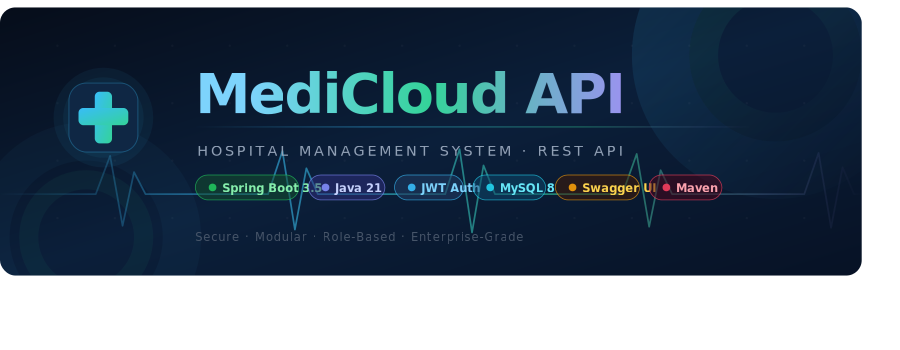

<div align="center">

<!-- BANNER -->
<p align="center">
  
</p>

<br/>


<br/>

> **MediCloud API** is an enterprise-grade, modular backend service built to fully digitalize hospital operations — from patient registration and appointment scheduling to electronic health records and billing. It serves as the central intelligence layer for modern Healthcare Information Systems (HIS).

</div>

---

## 📋 Table of Contents

- [✨ Features](#-features)
- [🏗️ Architecture](#️-architecture)
- [📂 Project Structure](#-project-structure)
- [🛡️ Security Model](#️-security-model)
- [🛠️ Tech Stack](#️-tech-stack)
- [🚀 Getting Started](#-getting-started)
- [🔌 API Reference](#-api-reference)
- [📖 Interactive Docs](#-interactive-docs)
- [🤝 Contributing](#-contributing)

---

## ✨ Features

| Feature | Description |
|---|---|
| 🔒 **Stateless JWT Auth** | Secure token-based authentication with BCrypt password hashing |
| 🛡️ **Role-Based Access Control** | Four distinct roles — `ADMIN`, `DOCTOR`, `STAFF`, `PATIENT` — with fine-grained permissions |
| 📅 **Appointment Scheduling** | Full appointment lifecycle: create, update, cancel, with conflict resolution |
| 🗂️ **EHR Management** | Patients access only their own records; staff and doctors have appropriately scoped access |
| 💳 **Integrated Billing** | Automated invoice generation and a mock payment gateway for financial tracking |
| 📬 **Notification Mocks** | Email and SMS notification stubs ready for real-world integration |
| 📜 **Interactive Swagger UI** | Auto-generated API documentation with live testing at `/swagger-ui.html` |
| ⚠️ **Centralized Error Handling** | Consistent, structured error responses across all endpoints |

---

## 🏗️ Architecture

MediCloud follows a clean, layered architecture with strict separation of concerns:

```
┌─────────────────────────────────────────────────────────────────┐
│                      Client Applications                        │
│                 (Web UI / Mobile / Postman)                      │
└──────────────────────────┬──────────────────────────────────────┘
                           │  HTTPS / REST
                           ▼
┌─────────────────────────────────────────────────────────────────┐
│                  Spring Security + JWT Filter                    │
│         Validates Bearer Token · Loads UserDetails              │
└──────────────────────────┬──────────────────────────────────────┘
                           │  Authenticated Request
                           ▼
┌─────────────────────────────────────────────────────────────────┐
│                       REST Controllers                          │
│      Auth · Admin · Appointment · Record · Billing · User       │
└──────────────────────────┬──────────────────────────────────────┘
                           │  DTOs
                           ▼
┌─────────────────────────────────────────────────────────────────┐
│                    Business Logic Services                       │
│        Validation · Scheduling · Access Rules · Invoicing        │
│                           │                                      │
│          ┌────────────────┼───────────────┐                     │
│          ▼                ▼               ▼                     │
│   Email/SMS Mocks   Payment Gateway   Shared Utilities          │
└──────────────────────────┬──────────────────────────────────────┘
                           │  JPA Entities
                           ▼
┌─────────────────────────────────────────────────────────────────┐
│               Spring Data JPA Repositories                       │
│                   Hibernate ORM Layer                            │
└──────────────────────────┬──────────────────────────────────────┘
                           │  SQL
                           ▼
┌─────────────────────────────────────────────────────────────────┐
│                     MySQL 8 Database                             │
└─────────────────────────────────────────────────────────────────┘
```

**Request lifecycle in brief:**
1. Client sends a request with a `Bearer` token in the `Authorization` header.
2. The JWT filter intercepts, validates the token, and loads the user's roles into the `SecurityContext`.
3. The matching `@RestController` handles the request, delegates business logic to a `@Service`.
4. The service applies domain rules, interacts with the database through `@Repository` interfaces.
5. A structured DTO response (or a standardized error envelope) is returned to the client.

---

## 📂 Project Structure

The project is organized into **domain-driven modules**. Each module is fully self-contained with its own controller, service, repository, entities, and DTOs.

```
src/main/java/com/medicloud/
│
├── config/                     # Global configurations
│   ├── OpenApiConfig.java      # Swagger/OpenAPI bean setup
│   └── AppConfig.java          # Application-wide beans
│
├── exception/                  # Centralized error handling
│   ├── GlobalExceptionHandler.java   # @ControllerAdvice catch-all
│   ├── ResourceNotFoundException.java
│   ├── AccessDeniedException.java
│   └── ErrorResponse.java      # Standard error envelope DTO
│
├── security/                   # Security layer
│   ├── SecurityConfig.java     # HttpSecurity, CORS, filter chain
│   ├── JwtTokenProvider.java   # Token generation & validation
│   ├── JwtAuthFilter.java      # OncePerRequestFilter implementation
│   └── UserDetailsServiceImpl.java
│
├── shared/                     # Cross-cutting utilities
│   ├── dto/                    # Shared request/response DTOs
│   ├── notification/           # Email & SMS mock services
│   └── payment/                # Mock payment gateway interface
│
└── module/                     # ── Core Domain Modules ──
    │
    ├── auth/                   # Authentication
    │   ├── AuthController.java      # POST /auth/login, /auth/register
    │   ├── AuthService.java
    │   └── dto/                     # LoginRequest, AuthResponse
    │
    ├── user/                   # Base user management
    │   ├── User.java                # @Entity — base user class
    │   ├── Role.java                # Enum: ADMIN, DOCTOR, STAFF, PATIENT
    │   └── UserRepository.java
    │
    ├── admin/                  # Admin operations
    │   ├── AdminController.java     # User provisioning, role assignment
    │   ├── AdminService.java
    │   └── dto/
    │
    ├── appointment/            # Scheduling engine
    │   ├── Appointment.java         # @Entity
    │   ├── AppointmentController.java
    │   ├── AppointmentService.java  # Conflict resolution logic
    │   ├── AppointmentStatus.java   # Enum: SCHEDULED, COMPLETED, CANCELLED
    │   ├── AppointmentRepository.java
    │   └── dto/
    │
    ├── record/                 # Electronic Health Records
    │   ├── HealthRecord.java        # @Entity
    │   ├── RecordController.java
    │   ├── RecordService.java       # Patient-scoped access enforcement
    │   ├── RecordRepository.java
    │   └── dto/
    │
    └── billing/                # Invoicing & payments
        ├── Invoice.java             # @Entity
        ├── BillingController.java
        ├── BillingService.java      # Invoice generation, status tracking
        ├── BillingRepository.java
        ├── PaymentService.java      # Delegates to mock gateway
        └── dto/
```

---

## 🛡️ Security Model

MediCloud uses **stateless JWT-based authentication** combined with Spring Security's role hierarchy.

### Authentication Flow

```
Client                       Server
  │                            │
  │── POST /auth/login ────────▶│
  │   { email, password }       │── Validate credentials
  │                             │── BCrypt.matches()
  │◀── 200 OK ─────────────────│── Generate JWT (signed, 24h TTL)
  │   { accessToken, type }     │
  │                             │
  │── GET /appointments ───────▶│
  │   Authorization: Bearer ... │── JwtAuthFilter intercepts
  │                             │── Validate signature + expiry
  │                             │── Load roles into SecurityContext
  │◀── 200 OK ─────────────────│── Controller handles request
```

### Role Permission Matrix

| Endpoint | ADMIN | DOCTOR | STAFF | PATIENT |
|---|:---:|:---:|:---:|:---:|
| `POST /auth/login` | ✅ | ✅ | ✅ | ✅ |
| `GET /appointments` | ✅ | ✅ | ✅ | ✅ (own only) |
| `POST /appointments` | ✅ | ✅ | ✅ | ✅ |
| `DELETE /appointments/{id}` | ✅ | ✅ | ✅ | ❌ |
| `GET /records` | ✅ | ✅ | ❌ | ✅ (own only) |
| `POST /records` | ✅ | ✅ | ❌ | ❌ |
| `GET /billing/invoices` | ✅ | ❌ | ✅ | ✅ (own only) |
| `POST /billing/payments` | ✅ | ❌ | ✅ | ✅ |
| `POST /admin/users` | ✅ | ❌ | ❌ | ❌ |

---

## 🛠️ Tech Stack

| Layer | Technology | Version |
|---|---|---|
| **Language** | Java | 21 LTS |
| **Framework** | Spring Boot | 3.5.7 |
| **Security** | Spring Security + jjwt | 0.11.5 |
| **ORM** | Spring Data JPA + Hibernate | Latest via Boot |
| **Database** | MySQL | 8.x |
| **API Docs** | SpringDoc OpenAPI (Swagger UI) | Latest |
| **Build** | Apache Maven | 3.x |
| **Password Hashing** | BCrypt | via Spring Security |

---

## 🚀 Getting Started

### Prerequisites

Make sure you have the following installed:

- **JDK 21** — [Download from Adoptium](https://adoptium.net/)
- **MySQL 8** — Running locally on port `3306`
- **Maven** (optional — a wrapper is included)

### 1. Clone the Repository

```bash
git clone https://github.com/Sripaadpatel/medicloud-api.git
cd medicloud-api
```

### 2. Configure the Database

Create a MySQL database and update `src/main/resources/application.properties`:

```properties
# Database
spring.datasource.url=jdbc:mysql://localhost:3306/medicloud_db?createDatabaseIfNotExist=true
spring.datasource.username=root
spring.datasource.password=your_secure_password

# JPA / Hibernate
spring.jpa.hibernate.ddl-auto=update
spring.jpa.show-sql=false
spring.jpa.properties.hibernate.format_sql=true

# JWT
app.jwt.secret=your_very_long_super_secret_key_here
app.jwt.expiration-ms=86400000

# Server
server.port=8080
server.servlet.context-path=/api/v1
```

> 💡 **Tip:** Set `spring.jpa.hibernate.ddl-auto=create` on first run to auto-generate the schema, then switch it to `update`.

### 3. Build & Run

Using the Maven wrapper (no Maven install required):

```bash
# Build
./mvnw clean install

# Run
./mvnw spring-boot:run
```

Or with Maven directly:

```bash
mvn clean install
mvn spring-boot:run
```

The API will be live at: **`http://localhost:8080/api/v1`**

### 4. Verify the Server is Running

```bash
curl http://localhost:8080/api/v1/actuator/health
# Expected: {"status":"UP"}
```

---

## 🔌 API Reference

### Authentication

#### `POST /auth/login`

Authenticate and receive a JWT token.

**Request:**
```json
{
  "email": "patient@example.com",
  "password": "securepassword123"
}
```

**Response `200 OK`:**
```json
{
  "accessToken": "eyJhbGciOiJIUzI1NiJ9...",
  "tokenType": "Bearer",
  "expiresIn": 86400000,
  "role": "PATIENT"
}
```

**Error `401 Unauthorized`:**
```json
{
  "timestamp": "2026-06-01T10:00:00",
  "status": 401,
  "error": "Unauthorized",
  "message": "Invalid email or password"
}
```

---

### Appointments

#### `POST /appointments` — Requires: `PATIENT`, `STAFF`, or `ADMIN`

Book a new appointment.

**Request:**
```json
{
  "patientId": 1,
  "doctorId": 2,
  "appointmentTime": "2026-06-15T10:30:00",
  "reason": "Routine Checkup"
}
```

**Response `201 Created`:**
```json
{
  "id": 101,
  "patientId": 1,
  "patientName": "John Doe",
  "doctorId": 2,
  "doctorName": "Dr. Smith",
  "appointmentTime": "2026-06-15T10:30:00",
  "reason": "Routine Checkup",
  "status": "SCHEDULED"
}
```

#### `GET /appointments/{id}` — Requires: Authentication

#### `PUT /appointments/{id}/cancel` — Requires: `STAFF` or `ADMIN`

---

### Electronic Health Records

#### `POST /records` — Requires: `DOCTOR` or `ADMIN`

```json
{
  "patientId": 1,
  "diagnosis": "Hypertension Stage 1",
  "prescription": "Amlodipine 5mg daily",
  "notes": "Patient advised lifestyle changes. Follow-up in 4 weeks."
}
```

#### `GET /records/patient/{patientId}` — Requires: `DOCTOR`, `ADMIN`, or the patient themselves

---

### Billing

#### `POST /billing/payments` — Requires: Authentication

```json
{
  "invoiceId": 50,
  "paymentMethodNonce": "fake-valid-nonce",
  "amount": 150.00
}
```

**Response `200 OK`:**
```json
{
  "transactionId": "TXN-8842931",
  "invoiceId": 50,
  "amountPaid": 150.00,
  "status": "SUCCESS",
  "processedAt": "2026-06-01T11:45:00"
}
```

---

## 📖 Interactive Docs

Once the server is running, explore the full API through **Swagger UI**:

```
http://localhost:8080/api/v1/swagger-ui.html
```

The Swagger UI allows you to:
- Browse all available endpoints grouped by module
- Try requests live with real authentication
- View full request/response schemas
- Download the raw OpenAPI spec (`/api/v1/v3/api-docs`)

**Authenticating in Swagger UI:**
1. Use `POST /auth/login` to get your token
2. Click the **Authorize** button (🔒) at the top right
3. Enter `Bearer <your_token>` and click **Authorize**
4. All subsequent requests will include your token automatically

---

## 🤝 Contributing

Contributions are warmly welcome! Here's how to get involved:

1. **Fork** the repository
2. **Create** a feature branch
   ```bash
   git checkout -b feature/your-feature-name
   ```
3. **Commit** your changes with a meaningful message
   ```bash
   git commit -m "feat: add patient discharge summary endpoint"
   ```
4. **Push** to your fork
   ```bash
   git push origin feature/your-feature-name
   ```
5. **Open a Pull Request** against `master`

### Commit Convention

This project follows [Conventional Commits](https://www.conventionalcommits.org/):

| Prefix | Use for |
|---|---|
| `feat:` | New features |
| `fix:` | Bug fixes |
| `refactor:` | Code improvements without feature change |
| `docs:` | Documentation updates |
| `test:` | Adding or updating tests |
| `chore:` | Build scripts, dependencies |

---

<div align="center">

Made with ❤️ for better healthcare systems

**[⬆ Back to top](#-table-of-contents)**

</div>
